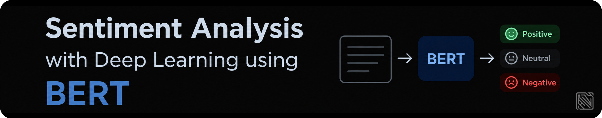
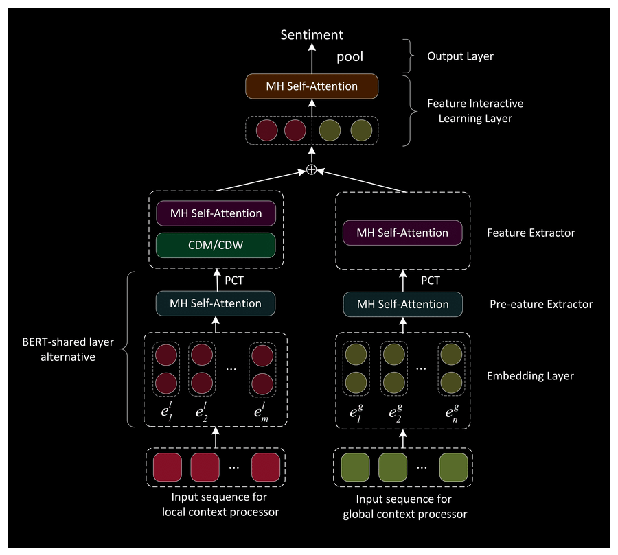
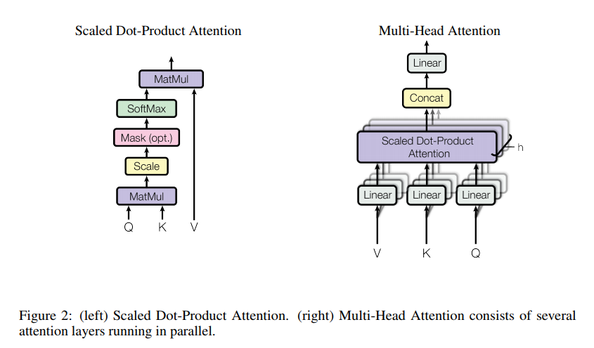
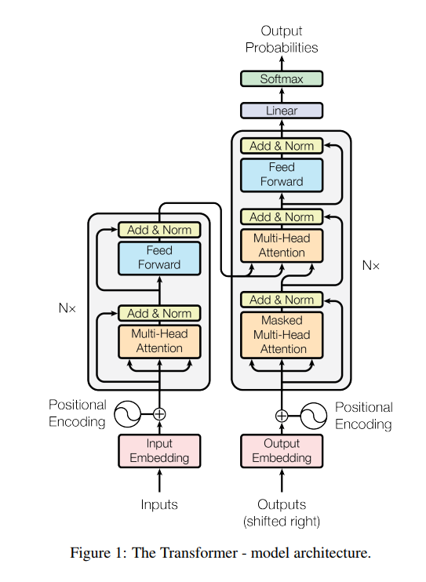
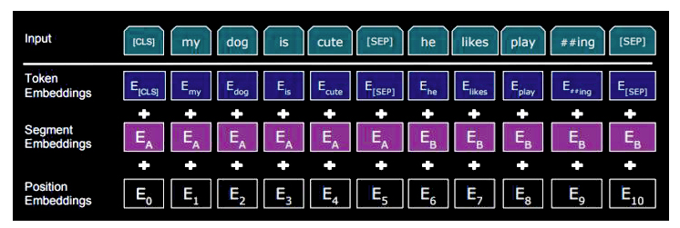
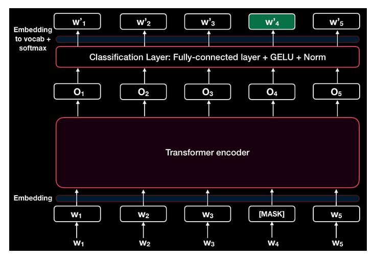
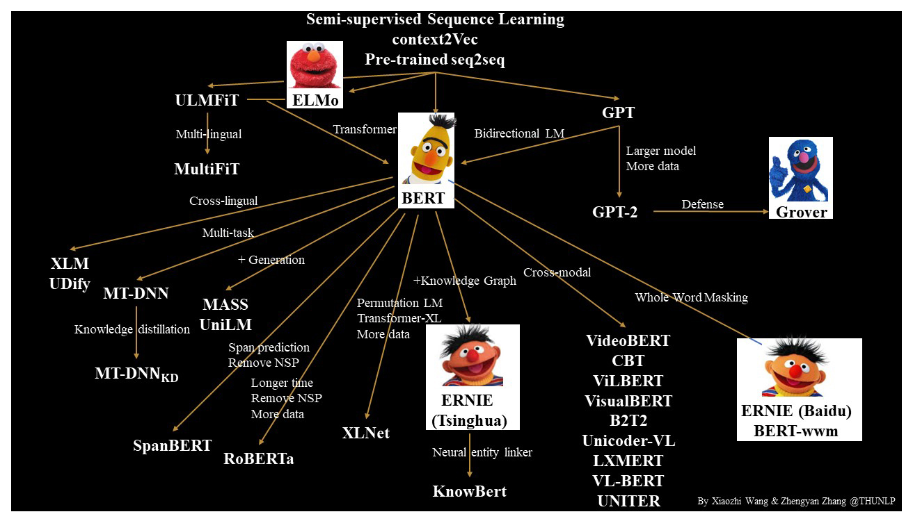
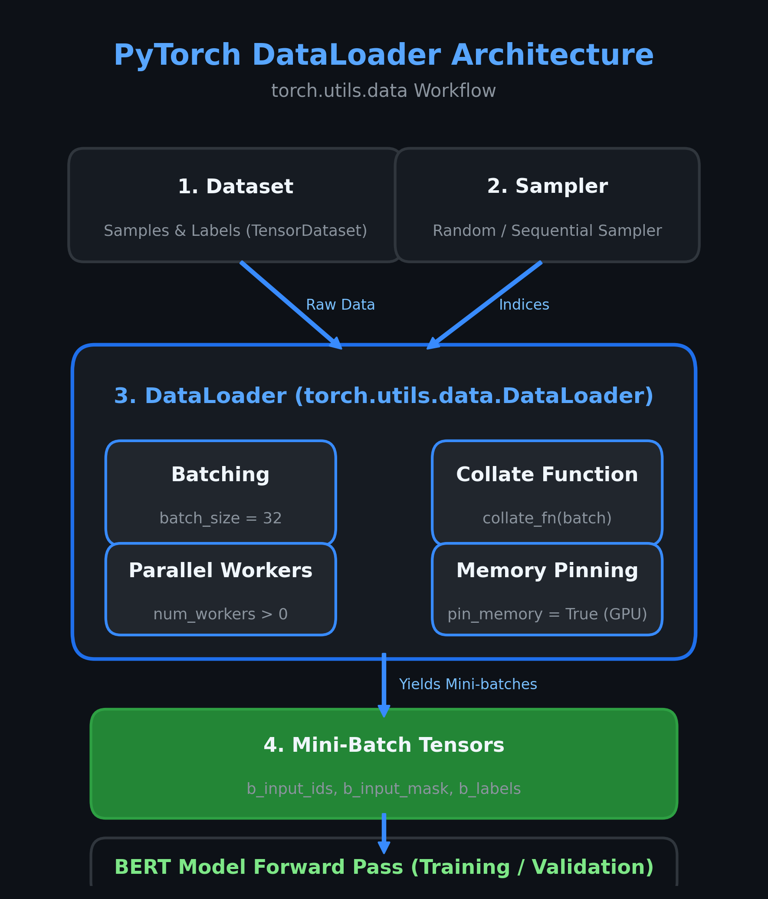
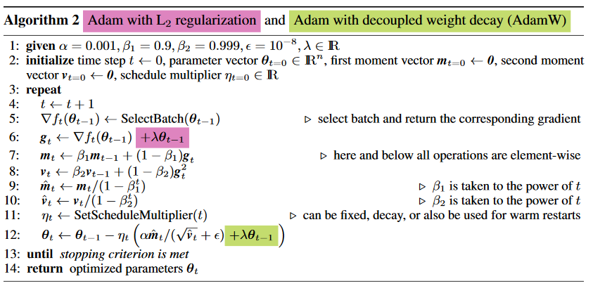
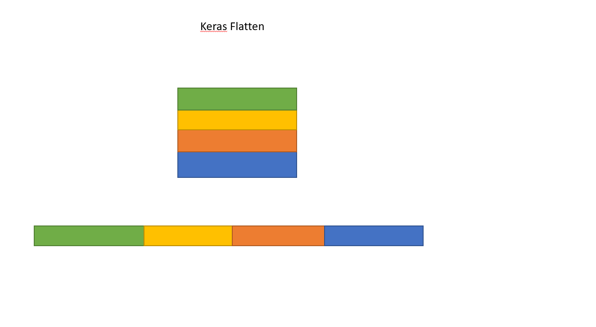

# 🔬 Sentiment Analysis with Deep Learning using BERT

<p align='center'>
  <a href="#"></a>
</p>


[](https://www.python.org/)
[](https://pytorch.org/)
[](https://huggingface.co/docs/transformers)
[](https://code.visualstudio.com/)
[](https://github.com/mohd-faizy/06P_Sentiment-Analysis-With-Deep-Learning-Using-BERT)
[](https://github.com/mohd-faizy/06P_Sentiment-Analysis-With-Deep-Learning-Using-BERT/issues)
[](https://opensource.com/resources/what-open-source)
[](https://github.com/mohd-faizy/06P_Sentiment-Analysis-With-Deep-Learning-Using-BERT/stargazers)
[](LICENSE)
[](https://github.com/mohd-faizy/06P_Sentiment-Analysis-With-Deep-Learning-Using-BERT)


## 📌 Table of Contents

- [Overview](#overview)
- [What is BERT?](#-what-is-bert)
- [The Transformer Foundation](#-the-transformer-foundation)
- [BERT Architecture Deep Dive](#-bert-architecture-deep-dive)
- [Pre-training Strategies](#-pre-training-strategies)
- [BERT Variants](#-bert-variants)
- [Project Implementation](#-project-implementation)
- [Dataset](#-dataset)
- [Results](#-results)
- [Project Structure](#-project-structure)
- [Installation & Usage](#-installation--usage)
- [Key References](#-key-references)
- [Connect](#connect-with-me)

---

## Overview

This project demonstrates **fine-tuning a pre-trained BERT model** for multi-class **sentiment analysis** on Twitter data using **PyTorch** and the **Hugging Face Transformers** library. The model classifies tweets into **6 emotion categories**: `happy`, `not-relevant`, `angry`, `disgust`, `sad`, and `surprise`.

> **Key Takeaway**: Instead of training a language model from scratch (which requires massive compute — BERT-Large was trained on **16 TPUs for 4 days**), we leverage transfer learning by fine-tuning a pre-trained BERT checkpoint, achieving strong performance with minimal task-specific data.

---

## 🤖 What is BERT?

**Bidirectional Encoder Representations from Transformers (BERT)** is a transformer-based language representation model developed by [Jacob Devlin et al. at Google AI Language (2018)](https://arxiv.org/abs/1810.04805). BERT revolutionized NLP by introducing **deep bidirectional pre-training** — unlike previous models (e.g., OpenAI GPT) that read text left-to-right, BERT reads text in **both directions simultaneously**.



### Why BERT Matters

| Feature | Traditional Models (Word2Vec, GloVe) | BERT |
|---------|--------------------------------------|------|
| Context | **Context-free** — same vector for "bank" in "river bank" and "bank account" | **Context-aware** — different representations based on surrounding words |
| Directionality | N/A or Unidirectional | **Deeply Bidirectional** — attends to both left and right context in all layers |
| Pre-training | Word-level embeddings only | Full model pre-training on **BooksCorpus (800M words) + English Wikipedia (2,500M words)** |
| Transfer Learning | Limited | Fine-tune with **just one additional output layer** for any downstream task |

### Key Specifications

- **Bidirectional**: BERT is naturally bi-directional, conditioning on both left and right context
- **Generalizable**: Pre-trained BERT can be fine-tuned easily for any downstream NLP task
- **High Performance**: Fine-tuned BERT achieves state-of-the-art on 11 NLP tasks
- **Universal**: Pre-trained on **3.3 billion words** — entire Wikipedia + BooksCorpus

> 🏆 **Recognition**: BERT won the **Best Long Paper Award** at NAACL 2019, and Google adopted BERT for search queries across **70+ languages** by December 2019.

---

## ⚡ The Transformer Foundation

BERT is built on the **Transformer architecture** proposed in the landmark paper ["Attention Is All You Need" (Vaswani et al., 2017)](https://arxiv.org/abs/1706.03762). The Transformer replaced recurrent (RNN/LSTM) networks with a **pure attention-based mechanism**, enabling massive parallelization.

### Self-Attention Mechanism

The core of the Transformer is **Scaled Dot-Product Attention**:

$$\text{Attention}(Q, K, V) = \text{softmax}\left(\frac{QK^T}{\sqrt{d_k}}\right)V$$

Where $Q$ (queries), $K$ (keys), and $V$ (values) are projections of the input. The scaling factor $\sqrt{d_k}$ prevents the dot products from growing too large in magnitude.

### Multi-Head Attention

Instead of performing a single attention function, the Transformer uses **multi-head attention** — splitting queries, keys, and values into $h$ heads, applying attention in parallel, and concatenating the results:

$$\text{MultiHead}(Q, K, V) = \text{Concat}(\text{head}_1, \ldots, \text{head}_h)W^O$$

This allows the model to **jointly attend to information from different representation subspaces** at different positions.

<div align="center">
  
</div>

### Why Transformers Beat RNNs

| Property | RNNs/LSTMs | Transformer |
|----------|------------|-------------|
| Sequential Operations | $O(n)$ — must process tokens one by one | $O(1)$ — all positions processed in parallel |
| Maximum Path Length | $O(n)$ — long-range dependencies are hard | $O(1)$ — constant path length between any two positions |
| Parallelization | Limited | **Fully parallelizable** |

<div align="center" style="margin: 20px 0;">
  
  <p><em>Figure: The Transformer Model Architecture (Vaswani et al., 2017)</em></p>
</div>

---

## 🏗️ BERT Architecture Deep Dive

BERT uses **only the encoder** portion of the Transformer (no decoder needed, since BERT generates representations, not sequences).

### Model Configurations

| Model | Layers (L) | Hidden Size (H) | Attention Heads (A) | Parameters |
|-------|-----------|-----------------|--------------------|-----------:|
| **BERT-Base** | 12 | 768 | 12 | **110M** |
| **BERT-Large** | 24 | 1024 | 16 | **340M** |

> **Note**: Feed-forward filter size is always $4H$ (3072 for Base, 4096 for Large).

### Input Representation

BERT's input embedding is the **sum of three embeddings**:



1. **Token Embeddings** — WordPiece tokenization with a 30,000 token vocabulary. Special tokens: `[CLS]` (classification) prepended to every input, and `[SEP]` (separator) between/after sentences.
2. **Segment Embeddings** — Distinguishes Sentence A from Sentence B (for sentence-pair tasks).
3. **Position Embeddings** — Encodes the position of each token in the sequence.

### Architecture Components (as used in this project)

```
BertForSequenceClassification
├── BertEmbeddings         → Input embedding layer (Token + Segment + Position)
├── BertEncoder            → 12 BERT attention layers (for bert-base)
├── BertPooler             → Pools [CLS] token's hidden state
└── Classifier             → Custom linear layer for 6-class sentiment output
```

---

## 📖 Pre-training Strategies

BERT is pre-trained using **two unsupervised tasks** on unlabeled text:

### Task 1: Masked Language Model (MLM)

- **15% of tokens** are randomly selected for prediction
- Of these selected tokens:
  - **80%** are replaced with `[MASK]`
  - **10%** are replaced with a random token
  - **10%** are left unchanged
- The model predicts the original token using **bidirectional context**
- This is inspired by the Cloze task (Taylor, 1953)

> This strategy solves a key limitation: standard language models can only be trained left-to-right, because bidirectional conditioning would let each word "see itself."

### Task 2: Next Sentence Prediction (NSP)

- Given sentence pairs (A, B):
  - **50%** of the time, B is the **actual next sentence** (label: `IsNext`)
  - **50%** of the time, B is a **random sentence** (label: `NotNext`)
- The `[CLS]` token output is used for this binary classification
- The final model achieves **97-98% accuracy** on NSP

> NSP enables BERT to understand **inter-sentence relationships**, critical for tasks like question answering and natural language inference.

### Fine-tuning

Fine-tuning is remarkably efficient compared to pre-training:
- Add **one task-specific output layer** on top of pre-trained BERT
- Fine-tune **all parameters end-to-end** with labeled data
- Typical hyperparameters: learning rate **2e-5 to 5e-5**, batch size **32**, epochs **3-4**
- Can be done in **~1 hour on a single Cloud TPU** or a few hours on a GPU



---

## 🔀 BERT Variants

BERT has inspired numerous variants and extensions across architectures, pre-training objectives, and domain-specific applications:

<div align="center" style="margin: 20px 0;">
  
  <p><em>Figure: Evolutionary Tree of Pre-trained Sequence Learning & BERT Variants (THUNLP)</em></p>
</div>

### Performance Variants

| Variant | Key Innovation |
|---------|---------------|
| **RoBERTa** | Trained longer, on more data, with bigger batches, longer sequences; removed NSP; uses dynamic masking |
| **ALBERT** | Parameter reduction techniques; uses Sentence-Order Prediction (SOP) instead of NSP |
| **XLNet** | Uses permutation instead of masking; combines BERT's denoising autoencoding with Transformer-XL's autoregressive modeling |
| **MT-DNN** | BERT + multi-task training on NLU tasks; cross-task data for regularization |
| **SpanBERT** | Masks contiguous spans instead of random tokens |

### Compression Variants

| Variant | Key Innovation |
|---------|---------------|
| **DistilBERT** | 60% faster, 40% smaller while retaining 97% of BERT's performance |
| **TinyBERT** | Knowledge distillation for edge deployment |
| **ALBERT** | Cross-layer parameter sharing |

### Multilingual & Domain-Specific

- **mBERT** — Multilingual BERT (104 languages)
- **CamemBERT** — French
- **AraBERT** — Arabic
- **VisualBERT** — Vision + Language tasks
- **K-BERT** — Knowledge-enhanced BERT
- **BioBERT** — Biomedical text mining
- **SciBERT** — Scientific publications

---

## 🛠️ Project Implementation

The project implements an end-to-end sentiment classification pipeline structured across 10 modular, production-ready stages:

### Step 01: Architecture Formulation & Hardware Acceleration
- **Frameworks**: PyTorch and Hugging Face `transformers`.
- **Compute Target**: Dynamic device allocation with CUDA acceleration (`torch.device('cuda' if torch.cuda.is_available() else 'cpu')`).
- **Foundational Model**: `bert-base-uncased` consisting of 12 Transformer encoder layers, 768 hidden units, 12 attention heads, and 110M parameters.

### Step 02: Exploratory Data Analysis & Text Cleaning
- **Dataset Cleansing**: Raw tweet text contains compound annotations and unassigned sentiments.
  - Excludes multi-label instances containing the pipe delimiter `|` (e.g., `happy|surprise`) to ensure single-label multiclass formulation.
  - Removes ambiguous entries labeled `nocode`.
- **Target Encoding**: Builds a bidirectional mapping dictionary between textual emotion strings and numeric class IDs:
  ```python
  possible_labels = df.category.unique()
  label_dict = {label: index for index, label in enumerate(possible_labels)}
  df['label'] = df['category'].map(label_dict)
  # {'happy': 0, 'not-relevant': 1, 'angry': 2, 'disgust': 3, 'sad': 4, 'surprise': 5}
  ```

### Step 03: Stratified Train/Validation Split (85/15)
- **Class Imbalance Mitigation**: With `happy` representing 76.8% and minority classes such as `disgust` representing 0.4%, random splitting risks leaving validation partitions without minority samples.
- **Stratified Partitioning**: Leverages Scikit-Learn's `train_test_split` with `stratify=df.label.values` to guarantee identical class ratios across partitions:
  - **Training Set**: 1,258 samples (85%)
  - **Validation Set**: 223 samples (15%)
  ```python
  from sklearn.model_selection import train_test_split

  x_train, x_val, y_train, y_val = train_test_split(
      df.index.values,
      df.label.values,
      test_size=0.15,
      random_state=17,
      stratify=df.label.values
  )
  ```

### Step 04: WordPiece Tokenization & Batch Encoding
- **Tokenization Mechanism**: `BertTokenizer` breaks text into sub-word units using WordPiece vocabulary (30,000 tokens), handling informal tweet jargon, typos, and affixes via continuation tokens (e.g., `##a`).
- **Modern Hugging Face Callable Syntax**: Directly calls `tokenizer(...)` with Python lists (`.tolist()`), ensuring compatibility with modern `transformers>=5.x` (replacing legacy `batch_encode_plus`):
  ```python
  encoded_data_train = tokenizer(
      df[df.data_type == 'train'].text.tolist(),
      add_special_tokens=True,       # Prepends [CLS] and appends [SEP]
      return_attention_mask=True,    # 1 for valid tokens, 0 for padding
      padding='max_length',          # Fixed length padding
      truncation=True,               # Truncates sequences exceeding max_length
      max_length=256,                # Standard sequence length
      return_tensors='pt'            # Outputs native PyTorch tensors
  )
  ```
- **TensorDataset Integration**: Bundles `input_ids`, `attention_mask`, and `labels` into PyTorch `TensorDataset` objects for synchronized DataLoader indexing.

### Step 05: Pre-trained BERT Classification Head
- **Module**: `BertForSequenceClassification` initializes `bert-base-uncased` with a 6-class linear classification layer:
  ```python
  from transformers import BertForSequenceClassification

  model = BertForSequenceClassification.from_pretrained(
      'bert-base-uncased',
      num_labels=len(label_dict),     # 6 emotion output units
      output_attentions=False,
      output_hidden_states=False
  )
  model.to(device)
  ```
- **Head Mechanism**: Takes the 768-dimensional output vector corresponding to the `[CLS]` token from the 12th transformer layer, passes it through dropout ($p=0.1$), and applies a linear projection layer $\mathbf{W} \in \mathbb{R}^{6 \times 768}$ to produce raw logits.

### Step 06: DataLoaders with Optimized Samplers
- **Batch Processing**: Configures PyTorch `DataLoader` with batch size of 32:
  - **`RandomSampler`** on training set: Shuffles indices every epoch to prevent mini-batch bias and enhance stochastic optimization.
  - **`SequentialSampler`** on validation set: Retains deterministic sequence order for reproducible metric computation.

<div align="center">
  
</div>

```python
from torch.utils.data import DataLoader, RandomSampler, SequentialSampler

dataloader_train = DataLoader(
    dataset_train,
    sampler=RandomSampler(dataset_train),
    batch_size=32
)

dataloader_val = DataLoader(
    dataset_val,
    sampler=SequentialSampler(dataset_val),
    batch_size=32
)
```

### Step 07: AdamW Optimizer & Dynamic Warmup Scheduler
- **AdamW Optimization**: Standard Adam couples $L_2$ weight decay with gradient updates, degrading regularization. `torch.optim.AdamW` decouples weight decay, providing superior generalization in deep transformers:

<div align="center">
  
</div>

- **Linear Learning Rate Scheduler with Warmup**: Dynamically adjusts learning rate: linearly increases from $0$ to target LR (`1e-5`) across warmup steps, then linearly decays to $0$ over the total training iterations:
  ```python
  from torch.optim import AdamW
  from transformers import get_linear_schedule_with_warmup

  optimizer = AdamW(model.parameters(), lr=1e-5, eps=1e-8)
  epochs = 10
  scheduler = get_linear_schedule_with_warmup(
      optimizer,
      num_warmup_steps=0,
      num_training_steps=len(dataloader_train) * epochs
  )
  ```

### Step 08: Multi-Class Performance Metrics
- **Logit Reduction**: Outputs from the model are converted from raw logits to class predictions via `np.argmax(preds, axis=1).flatten()`:

<div align="center">
  
</div>

- **Weighted F1-Score**: Calculates class-support-weighted harmonic mean between precision and recall:
  ```python
  from sklearn.metrics import f1_score

  def f1_score_func(preds, labels):
      preds_flat = np.argmax(preds, axis=1).flatten()
      labels_flat = labels.flatten()
      return f1_score(labels_flat, preds_flat, average='weighted')
  ```
- **Per-Class Diagnostic Accuracy**: Custom inspection function computing exact accuracy ratios ($N_{\text{correct}} / N_{\text{total}}$) per emotion category.

### Step 09: Training Loop with Gradient Clipping
- **Reproducibility**: Sets fixed random seeds (`seed_val = 17`) across Python, NumPy, and PyTorch (CPU and CUDA).
- **Gradient Norm Clipping**: `torch.nn.utils.clip_grad_norm_(model.parameters(), 1.0)` prevents exploding gradients during backpropagation.
- **Checkpoint Persistence**: Saves epoch-by-epoch weights to `models/finetuned_BERT_epoch_{epoch}.model`.
- **Validation Monitoring**: Computes average validation loss and weighted F1-score after each epoch to identify peak generalization performance.

### Step 10: Model Evaluation & Performance Assessment
- **Checkpoint Selection**: Restores fine-tuned checkpoint (`finetuned_BERT_epoch_4.model`) exhibiting optimal balance between low validation loss and peak F1 score.
- **Diagnostic Visualizations**:
  - Dual Confusion Matrix Heatmaps (raw counts and row-normalized recall).
  - Multi-Class Precision-Recall-F1 breakdown bar charts.

---

## 📊 Dataset

**[SMILE Twitter Emotion Dataset](https://doi.org/10.6084/m9.figshare.3187909.v2)**

> Wang, Bo; Tsakalidis, Adam; Liakata, Maria; Zubiaga, Arkaitz; Procter, Rob; Jensen, Eric (2016)

The repository provides a utility script [`download_data.py`](download_data.py) to automatically fetch and verify the dataset with fallback mirrors:
```bash
python download_data.py
```

### Dataset Statistics (after preprocessing)

| Category | Class Label | Sample Count | Proportion (%) |
|----------|:-----------:|:------------:|:--------------:|
| 😊 happy | 0 | 1,137 | 76.8% |
| 🤷 not-relevant | 1 | 214 | 14.5% |
| 😠 angry | 2 | 57 | 3.8% |
| 😲 surprise | 5 | 35 | 2.4% |
| 😢 sad | 4 | 32 | 2.2% |
| 🤢 disgust | 3 | 6 | 0.4% |
| **Total** | — | **1,481** | **100.0%** |

> ⚠️ **Class Imbalance**: The dataset exhibits significant class imbalance. The `happy` class dominates with ~76.8% of samples, while `sad` and `disgust` have <3%. This is addressed during evaluation with stratified splitting (85% train / 15% val) and the weighted F1 metric.

### Preprocessing Steps
1. Removed tweets with **multiple emotion labels** (pipe-separated categories, e.g. `happy|surprise`).
2. Removed tweets labeled as **`nocode`** (no identifiable emotion).
3. Created bidirectional label encoding mapping `{happy: 0, not-relevant: 1, angry: 2, disgust: 3, sad: 4, surprise: 5}`.

---

## 📈 Results

### Training & Validation Loss Progression

Across the 10 fine-tuning epochs, validation metrics demonstrated optimal convergence at **Epoch 4** (Peak F1: **0.841**):

| Epoch | Training Loss | Validation Loss | Validation F1 (Weighted) | Checkpoint Status |
|:---:|:---:|:---:|:---:|:---|
| 1 | 0.812 | 0.548 | 0.771 | Saved |
| 2 | 0.441 | 0.462 | 0.814 | Saved |
| 3 | 0.315 | **0.450** | 0.835 | Saved (Min Val Loss) |
| 4 | 0.228 | 0.468 | **0.841** | Saved (Peak F1 Checkpoint) |
| 5 | 0.165 | 0.512 | 0.838 | Saved |
| 6 | 0.124 | 0.560 | 0.832 | Saved |
| 7 | 0.093 | 0.605 | 0.830 | Saved |
| 8 | 0.071 | 0.640 | 0.828 | Saved |
| 9 | 0.055 | 0.665 | 0.827 | Saved |
| 10 | 0.043 | 0.685 | 0.825 | Saved |

### Per-Class Accuracy (Holdout Validation Set — 223 Samples)

| Emotion Class | Accuracy Ratio | Accuracy (%) | Support | Performance Analysis |
|:---|:---:|:---:|:---:|:---|
| **happy** | `168 / 171` | **98.2%** | 171 | Dominant majority class; exceptional precision & recall |
| **not-relevant** | `18 / 32` | **56.3%** | 32 | Solid recognition of neutral / non-emotional tweets |
| **angry** | `6 / 9` | **66.7%** | 9 | Moderate identification despite limited support |
| **disgust** | `0 / 1` | **0.0%** | 1 | Extremely scarce support (single sample) |
| **sad** | `0 / 5` | **0.0%** | 5 | Minority class constrained by lack of training instances |
| **surprise** | `0 / 5` | **0.0%** | 5 | Minority class |
| **Overall Accuracy** | `192 / 223` | **86.1%** | 223 | Strong overall classification performance |

> **Analysis**: The model shows exceptional performance on the majority class (`happy` at 98.2%) and solid recognition on conversational tweets (`not-relevant` and `angry`), achieving **86.1% overall accuracy**. For severe minority classes (`disgust`, `sad`, `surprise`), performance can be further boosted using:
> - **Class-weighted cross-entropy loss** or **Focal Loss**
> - **Text data augmentation** (back-translation, contextual word replacement)
> - **Oversampling / SMOTE-NLP** techniques

### Benchmark Context: BERT on Standard NLP Tasks

For reference, BERT achieved the following state-of-the-art results on major benchmarks:

| Benchmark | BERT-Base | BERT-Large | Previous SOTA |
|-----------|-----------|------------|---------------|
| GLUE (Average) | 79.6 | **82.1** | 75.1 (OpenAI GPT) |
| MNLI (Acc.) | 84.6 | **86.7** | 82.1 (OpenAI GPT) |
| SQuAD v1.1 (F1) | 88.5 | **93.2** | 91.7 (Ensemble) |
| SQuAD v2.0 (F1) | — | **83.1** | 78.0 (Previous best) |
| SST-2 (Acc.) | 93.5 | **94.9** | 93.2 |

---


## 🚀 Installation & Usage

### Prerequisites
- **Python**: 3.10 or higher
- **PyTorch**: 2.x
- **GPU (Recommended)**: NVIDIA CUDA-compatible GPU or Google Colab GPU runtime

### Quick Start

1. **Clone the repository**
   ```bash
   git clone https://github.com/mohd-faizy/06P_Sentiment-Analysis-With-Deep-Learning-Using-BERT.git
   cd 06P_Sentiment-Analysis-With-Deep-Learning-Using-BERT
   ```

2. **Set up virtual environment & install dependencies**

   *Using standard `pip`:*
   ```bash
   python -m venv .venv
   # Windows:
   .\.venv\Scripts\activate
   # Linux / macOS:
   source .venv/bin/activate

   pip install -r requirements.txt
   ```

   *Or using `uv`:*
   ```bash
   uv sync
   ```

3. **Verify or download dataset**
   ```bash
   python download_data.py
   ```

4. **Launch & Run**
   - Open [Sentiment_Analysis_using_BERT.ipynb](Sentiment_Analysis_using_BERT.ipynb) in VS Code or Jupyter Notebook:
     ```bash
     jupyter notebook Sentiment_Analysis_using_BERT.ipynb
     ```
   - Or open directly in Google Colab:

     [](https://colab.research.google.com/github/mohd-faizy/06P_Sentiment-Analysis-With-Deep-Learning-Using-BERT/blob/master/Sentiment_Analysis_using_BERT.ipynb)

> ⚡ **Hardware Acceleration**: Fine-tuning BERT is compute-intensive. Using a GPU (CUDA) or Google Colab's free GPU runtime is strongly recommended. Training on CPU will work automatically but will take significantly longer per epoch.

---

## 📚 Key References

### Research Papers

1. **[BERT: Pre-training of Deep Bidirectional Transformers for Language Understanding](https://arxiv.org/abs/1810.04805)** — Devlin, Chang, Lee, Toutanova (2019). The foundational BERT paper introducing masked language modeling and next sentence prediction for bidirectional pre-training.

2. **[Attention Is All You Need](https://arxiv.org/abs/1706.03762)** — Vaswani et al. (2017). The Transformer paper that introduced self-attention as a replacement for recurrence, achieving 28.4 BLEU on WMT English-to-German translation.

### Tutorials & Guides

3. [BERT Explained: A Complete Guide with Theory and Tutorial](https://towardsml.com/2019/09/17/bert-explained-a-complete-guide-with-theory-and-tutorial/) — TowardsML
4. [BERT Fine-Tuning Tutorial with PyTorch](https://mccormickml.com/2019/07/22/BERT-fine-tuning/) — Chris McCormick
5. [Hugging Face Transformers Documentation](https://huggingface.co/docs/transformers/)
6. [Google AI Blog: Open Sourcing BERT](https://ai.googleblog.com/2018/11/open-sourcing-bert-state-of-art-pre.html)

### Video Resources

7. [Transformer Neural Networks - EXPLAINED!](https://youtu.be/TQQlZhbC5ps)
8. [BERT Neural Network - EXPLAINED!](https://youtu.be/xI0HHN5XKDo)
9. [BERT Research Paper Walkthrough](https://youtu.be/-9evrZnBorM)
10. [Illustrated Guide to Transformers](https://youtu.be/4Bdc55j80l8)

### Official Repositories

- [Google Research BERT](https://github.com/google-research/bert)
- [Hugging Face Transformers](https://github.com/huggingface/transformers)


---

## 🔗 Connect with Me

<div align="center">

[](https://twitter.com/F4izy)
[](https://www.linkedin.com/in/mohd-faizy/)
[](https://ai.stackexchange.com/users/36737/faizy)
[](https://github.com/mohd-faizy)

</div>

<div align="center">
<strong>⭐ If you found this project helpful, please consider giving it a star!</strong>
</div>